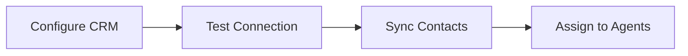
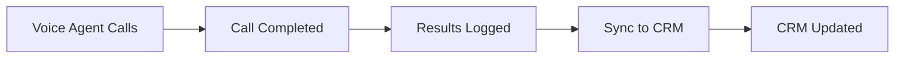

# 🔗 CRM Integration Guide for AgentSDR

This guide shows you how to connect popular CRMs to your AgentSDR platform for seamless contact management and call result synchronization.

## 🎯 Supported CRMs

### ✅ Currently Implemented:
- **HubSpot** - Most popular, great free tier
- **Salesforce** - Enterprise-grade CRM
- **Pipedrive** - Sales-focused CRM (coming soon)
- **Zoho CRM** - Cost-effective option (coming soon)

## 🚀 Quick Setup

### 1. **HubSpot Integration (Recommended)**

#### Step 1: Get HubSpot API Key
1. Go to [HubSpot Developer Account](https://developers.hubspot.com/)
2. Create a new app or use existing
3. Get your **Private App Access Token**

#### Step 2: Configure Environment
Add to your `.env` file:
```bash
# CRM Configuration
CRM_TYPE=hubspot
HUBSPOT_API_KEY=your_hubspot_api_key_here
```

#### Step 3: Test Connection
```bash
curl -X GET http://localhost:8080/api/crm/status \
  -H "Authorization: Bearer YOUR_JWT_TOKEN"
```

### 2. **Salesforce Integration**

#### Step 1: Create Connected App
1. Go to Salesforce Setup → App Manager
2. Create New Connected App
3. Enable OAuth settings
4. Get Client ID and Client Secret

#### Step 2: Configure Environment
```bash
# Salesforce Configuration
CRM_TYPE=salesforce
SALESFORCE_CLIENT_ID=your_client_id
SALESFORCE_CLIENT_SECRET=your_client_secret
SALESFORCE_USERNAME=your_username
SALESFORCE_PASSWORD=your_password_with_security_token
```

## 📊 API Endpoints

### **Check CRM Status**
```bash
GET /api/crm/status
```
Response:
```json
{
  "connected": true,
  "crm_type": "HubSpot",
  "message": "Connected"
}
```

### **Sync Contacts from CRM**
```bash
POST /api/crm/contacts/sync
```
Response:
```json
{
  "message": "Contacts synced successfully",
  "synced": 150,
  "updated": 25,
  "total": 175
}
```

### **Get Synced Contacts**
```bash
GET /api/crm/contacts
```
Response:
```json
{
  "contacts": [
    {
      "id": "contact-123",
      "crm_id": "hubspot-456",
      "first_name": "John",
      "last_name": "Doe",
      "email": "john@company.com",
      "phone": "+1234567890",
      "company": "Acme Corp",
      "status": "active",
      "voice_agent_id": null
    }
  ],
  "total": 175
}
```

### **Assign Contact to Voice Agent**
```bash
POST /api/crm/contacts/{contact_id}/assign-agent
Content-Type: application/json

{
  "agent_id": "agent-123"
}
```

### **Sync Call Results to CRM**
```bash
POST /api/crm/sync-call-result
Content-Type: application/json

{
  "contact_id": "contact-123",
  "call_data": {
    "duration": 120,
    "status": "completed",
    "outcome": "interested",
    "agent_name": "Sales Agent",
    "notes": "Customer interested in premium package"
  }
}
```

## 🔄 Integration Workflow

### **1. Initial Setup**


### **2. Call Workflow**


## 💡 Benefits of CRM Integration

### **For Sales Teams:**
- ✅ **Unified Contact Management** - All contacts in one place
- ✅ **Automatic Call Logging** - No manual data entry
- ✅ **Lead Scoring Updates** - Real-time status updates
- ✅ **Pipeline Visibility** - Track conversion rates

### **For Managers:**
- ✅ **Performance Analytics** - Call success rates by agent
- ✅ **ROI Tracking** - Revenue attribution to voice agents
- ✅ **Data Consistency** - Single source of truth
- ✅ **Compliance** - Automatic call documentation

### **For Developers:**
- ✅ **Standardized API** - Same interface for all CRMs
- ✅ **Bi-directional Sync** - Data flows both ways
- ✅ **Error Handling** - Robust retry mechanisms
- ✅ **Extensible** - Easy to add new CRMs

## 🛠️ Advanced Configuration

### **Custom Field Mapping**
```python
# In crm_integration.py, customize field mapping:
def map_hubspot_contact(hubspot_data):
    return Contact(
        id=hubspot_data.get('id'),
        first_name=hubspot_data.get('properties', {}).get('firstname'),
        # Add custom field mappings here
        custom_fields={
            'lead_score': hubspot_data.get('properties', {}).get('hubspotscore'),
            'lifecycle_stage': hubspot_data.get('properties', {}).get('lifecyclestage')
        }
    )
```

### **Webhook Integration**
For real-time updates, set up webhooks:

```python
@app.route('/webhook/crm/contact-updated', methods=['POST'])
def handle_crm_webhook():
    """Handle real-time CRM updates"""
    data = request.json
    # Process contact updates from CRM
    # Update local database
    return jsonify({'status': 'processed'})
```

## 🔧 Troubleshooting

### **Common Issues:**

#### **"No CRM integration configured"**
- Check your `.env` file has correct CRM_TYPE
- Verify API credentials are set
- Restart the server after changes

#### **"Authentication failed"**
- **HubSpot**: Check API key is valid and has contacts scope
- **Salesforce**: Verify username/password and security token

#### **"Contact not found"**
- Run contact sync first: `POST /api/crm/contacts/sync`
- Check enterprise association is correct

### **Debug Mode:**
```bash
# Enable debug logging
export DEBUG_CRM=true
python main.py
```

## 📈 Next Steps

1. **Set up your preferred CRM** using the guide above
2. **Sync your contacts** to start using voice agents
3. **Configure webhooks** for real-time updates
4. **Monitor performance** through CRM analytics

## 🤝 Contributing

Want to add support for another CRM? 

1. Create a new class inheriting from `CRMIntegration`
2. Implement the required methods
3. Add to `CRMFactory`
4. Submit a pull request!

## 📞 Support

Need help with CRM integration?
- Check the troubleshooting section above
- Review API documentation
- Contact support with specific error messages
